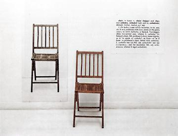
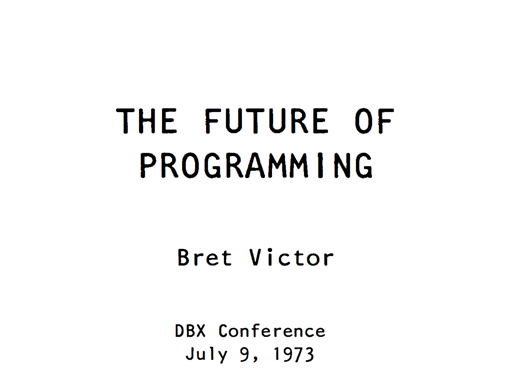

# N개의 맥락 
- *마지막 수정 : 2026-01-23*
- 김승범 (Seungbum Kim), https://metakits.cc

## 세 개의 의자들
1965년 조셉 코수스(Joseph Kosuth)는 *'하나 그리고 세 개의 의자들'* 을 발표했다. 기호의 개념을 다루는 작품으로 의자라는 개념을 보여주기 위해 '실물의 의자, 의자 사진, 의자에 대한 사전적 정의'를 한 자리에 두었다. {{sn: '하나 그리고 세 개의 의자들', 조셉 코수스, 1965  }} 직관적이고 간단하게 보이는 이 작업은 생각할 거리를 많이 던져준다.{{sn: 실제로 이 작품은 나의 몇 가지 작업에 큰 영감을 주었다. 관점이 다른 두 코딩언어를 다루는 '다른 언어 드로잉'과 전문가와 비전문가 모두에게 생소한 코딩언어를 도입한 drawForth를 예로 들 수 있다. 특히 drawForth를 사용했던 워크숍의 제목은 '하나, 그리고 세 개의 코드'였다.   - 다른 언어 드로잉 https://metakits.cc/projects/2langs   - 하나, 그리고 세 개의 코드 https://metakits.cc/projects/1n3-codes/ }} 

작품에 대한 작가의 의도, 개념미술에서 이 작품의 위치를 별개로 하더라도, 나는 이 작품을 몇 가지 '개인적인' 방식으로 읽곤한다. 첫째는 어떤 개념에 대해 이해하는 것, 즉 앎을 생각한다. 명제적 지식(사실)과 절차적 지식(기술)으로 나눈 것이 아닌 점진적으로 확장하는 앎이다. 이 작품을 예로 내가 의자에 대해 안다는 것이 무엇일까 생각해 볼 수 있다. 의자에 앉을 수 있고, 의자라는 다양한 이미지를 떠올리고 구분할 수 있다. 그리고 추상적인 기호로 의자라는 것이 무엇인지 설명할 수도 있다. 실물을 만지고 사용할 때, 이미지를 보며 인식할 때, 사물의 정의를 표현할 수 있을 때 그 각 방식마다 대상에 대한 앎은 늘어난다. 이 정도만 알면 나는 대상을 다 안다고 말할 수 있을까? 실은 항상 앎에 +1 이 되는 과정이 존재한다. 의자의 경우 내가 직접 만들어 본다면 그 이해도는 증가할 것이다. 

둘째는 맥락에 대해 떠올린다. 친구들과 모여서 의자에 대해 대화를 한다고 생각해보자. 명확해보이는 이 사물에 대해 이야기하면서 각자가 다른 맥락을 가지기도 한다. 누군가는 실물 의자를, 누군가는 디자인적인 의자의 이미지를, 누군가는 추상적 개념으로의 의자를 말할텐데 서로의 맥락 차이로 대화가 단절이 되기도하고 차이가 있음에도 마치 하나인양 어울릴 때도 있다. 하나의 개념이 한 곳에 정박해 있지 않고, 단순한 개념도 실은 여러 맥락을 둥둥 떠 다니는 게 우리의 일상이다.

## 맥락
예전에 간단한 기술로 컴퓨팅의 개념을 경험하는 어떤 워크숍을 진행하다가 내가 습관적으로 쓰던 '맥락'이라는 단어에 반응하는 참가자가 있었다. 워크숍을 마치고 회고를 하는 중에 그 참가자는 맥락이라는 단어를 콕 집어 본인이 이 개념과 어떤 씨름을 했는지를 설명하면서 대학원 과정에서 공부하는 중임을 드러냈다. 누군가에게는 이 단어가 학술적으로 보였고, 어떤 점에서는 (지적 매력을 품은) 장식으로 보이기도 했나 보다. 

일상생활에서 꽤 쓸법하다고 생각했지만 결코 쉽게 이해되지 않는 단어가 바로 '맥락'이다. 내가 왜 이 단어를 종종 쓰게 되었는지 돌이켜보면 순전히 앨런 케이(Alan C. Kay)의 영향이라 볼 수 있다. 이제야 솔직히 말하면 영웅처럼 쫓던 그의 말에 자주 등장하던 맥락(Context){{sn: (2017년 9월의 개인 메모 중) 그 내용 자체는 알고 있었지만, 정확히 공감이 되지 않았다. 해당 예제는 너무 당연해보였다. 이 이야기는 시무어 페퍼트의 Mathland와도 일맥상통하고, 그동안 앨런케이가 말했던 '관점의 변화는 IQ 80의 상승과 맞먹는다'는 표현과도 같은 맥락이었다. }}을 나는 그가 진정 어떤 의도로 말한건지 정확히 이해하지 못하면서, 알고 싶었기에 계속 썼던 거 같다. 앨런 케이는 물 속의 물고기를 예로 들며 맥락의 힘을 설명했다.

>*"땅 위의 물고기도 펄떡거린다. 그러나 만약 물고기가 가장 적합한 환경인 물 속에서 펄떡거리면 그 결과는 
질적으로 달라진다."* (check:정확한 출처)

행위자로서 행위하는 부분과 그 행위가 일어나는 (그래서 영향을 끼치는) 환경의 관계에 대해 생각해보게 된다. 환경은 결국 맥락을 말한다. '물 만난 물고기'라는 말이 그냥 나온 말이 아닐 것이다.

## 프로그래밍의 미래

매체 디자이너{{sn:매체 디자이너란 말은 없다. 그러나 브렛 빅터를 단순히 UI 디자이너라고 말하기엔 그의 행보를 담아내기 어렵다. 고속으로 발전하는 기술 시대에 자기의 속도로 미래에 대한 걱정과 동적매체 (Dynamic Medium) 를 실험하는 모습은 그의 웹사이트에서 확인할 수 있다. https://worrydream.com/ }}이자 컴퓨터 과학자인 브렛 빅터(Bret Victor)는 1973년 7월 9일 프로그래밍의 미래(The Future of Programming)라는 제목의 발표를 했다.{{sn:오타가 아니다. 농담이다. 실제 발표일은 2013년이었다. https://worrydream.com/dbx/ }} OHP를 사용해서 발표자료를 보여줬고, 현재가 마치 1973년인양 말하면서 청중의 웃음을 자아냈다. 공기를 바꾸는 오프닝이었고, 일종의 퍼포먼스였다. 그리고 그 행위는 단순히 분위기 환기가 아닌, 맥락을 바꾸는 힘을 가졌다. 현재의 위치에서 과거를 말하는 것은 되돌아보기에 머문다. 회상이다. 그러나 마치 집단 최면을 걸듯 과거를 현재화하면 그 시기의 맥락 속으로 들어가게 된다. 과거의 렌즈로 (과거 입장에선 미래인) 현재를 다시 보게 만들 수 있다.

## 코딩
- 어떤 맥락에 놓이냐에 따라 여러 의미와 늬앙스를 갖게 된다.
	- 프로그래밍보다 평가절하된 작업으로 받아들여지기도 했고,
	- 컴퓨터 밖의 맥락에서 두루 사용되거나, 인류 보편적 행위로 코딩을 보기도 했다.
- 여기에 '교육'이란 단어가 붙으면 맥락에 따라, 그 조합에 따라 다양한 관점으로 논의된다.
	- 앞서 말한 '코딩'의 맥락
	- '교육'의 맥락 역시 매우 다양한 접근과 가치관이 있지

## 마인드스톰
- [[Mindstorms]] [[Object-to-think-with]] 에서 object는 기능적 도구가 아니라 맥락을 만든다.
- 맥락이 개인적인 애착과 함께 더 강화된다. [[@Evocative Objects]]
- 코딩 교육? 배움에 대한 고전이 실은 우리가 새로운 기술매체를 맥락으로 받아들일 때의 태도에 대해 다루고 있다.

## 개인적인 맥락
- Personal이란 결국 나에게 중요한 맥락으로 재해석, 창작, 바라보기를 하는 것
- 동일한 책도 결코 한 방향으로만 읽히지 않는다.
	- 한 사람이 여러 방식으로 읽는 경험을 하기도 한다.
	- 상황에 따라 최적의 요약은 달라질 수 있다.
	- 최근 스쿨링 책 에세이에서 그 내용을 담았다. {{sn:<스쿨링: 사사로이 배우는 기술>, 2025, 펨텍톡 (https://femtechtalk.com/) }}
- 그래서 맥락을 (나에게 의미가 생길 방향으로) 바꾸는 방법은?
	- 그동안 여러 방식이 창의성 기법 등의 논리로 있어왔다.
	- 내가 하고 싶은 말은 그 중에서도 형식(form)을 바꾸는, 그런 힘을 가지는 것에 대한 이야기

## 다른 형식이 다른 맥락을 만든다
- 다른 형식 -> (다른 맥락) -> 다른 관점
- 코딩어의 이야기
	- 과거 2개의 언어 작업이랑 연결된다.
	- 더 진행시키면 N개의 언어(관점)이 된다.
	- 종류의 가짓수가 아닌, N개의 패러다임으로써의 N개의 언어. 
		- 예) 개미수열 by 한주영 https://www.dropbox.com/scl/fi/xfny707l6r8mjgphoee0t/programming-look-and-say.pdf?rlkey=0kvgz3li6ophq3tkmjdsfx3wn&dl=0
	- 단순히 "관점을 바꿔라"가 잘 동작하지 않는다 생각한다. 왜냐하면 자칫 여전히 같은 맥락에 머물러 있기 때문이다.
		- 생각하는 기본 틀, 환경이 바뀌어야하는데, 즉, 맥락이 바뀌어야하는데, 
		- 바뀐 맥락에 놓여야한다는게 더 올바른 표현일지도 모른다.
		- 언어마다 관점이 다 달라를 백번 말하는 것 보다, 다른 사고방식의 언어를 직접 써보면서 머리와 몸으로 함께 느껴보는 편이 더 새로운 맥락에 놓이는 것이다.
		- 새로운 형식, 형식체계는 새로운 맥락에 놓이게 될 기회를 준다.
- 게임 형식의 이야기
	- 테트리스의 예 : 공간을 확장하면 무의미한 테트리스가 된다. 게임의 목적/가치가 바뀜
	- 테트리스의 예2 : DIY 블록 테트리스. 블록을 설계하면서 다른 맥락의 게임으로 바뀜
	- 비주얼드 장르의 예 : 그림/Rule을 정의하는 비주얼드의 가능성
		- 개개인이 다양한 이야기를 하는 형식으로 바뀔 수 있음

## 형식을 바꾸는 힘
- 정해진 답이나 효율성, 요구사항 충족의 접근과는 결이 다른
- (설계된, 혹은 설계 밖의)인터페이스를 그 기술매체의 속성으로 접근하는 경로라고 할 때, 
	- 접근해야 할 기술매체의 속성은? 컴퓨팅과 메타미디어
	- 모든 속성에 접근할 단일한 인터페이스는 없는거 같다. 예) [[Turing Complete]]한 컴퓨팅 속성에 접근하는 언어는 수많은 관점의 시도가 있고, 서로의 경험이 다르다.
	- 즉, 형식을 바꾸는 힘이 가지는 의미
- [[Vibe Coding#Embrace Exponentials]] -> 방대한 형식을 찾고, 여러 맥락을 경험하는 -> Personal 찾기
- 이 과점에서 Vibe Coding의 가치 재인식
	- 즉, AI를 / AI에의한 형식을 정의하는 메타적 접근의 가치
- 최근 오영진 샘은 문학기계 실험으로 발표를 했다. [[2026-01-09 AI 시대 창작 문예학 토론]]

- '메타미디어'의 의미
- [[Metamedia]], 내가 말하는 이 개념의 정의의 시작점은? 
	- [[Alan C. Kay]]가 말하는 것이나, [[@Personal Dynamic Media]]
	- 혹은 [[Lev Manovich]]의 언급도 찾아볼 필요가 있다. [[Software Takes Command]]

## 그래서, 그것이 우리의 맥락을 지켜줄 것인가?

---
# 참고문헌

